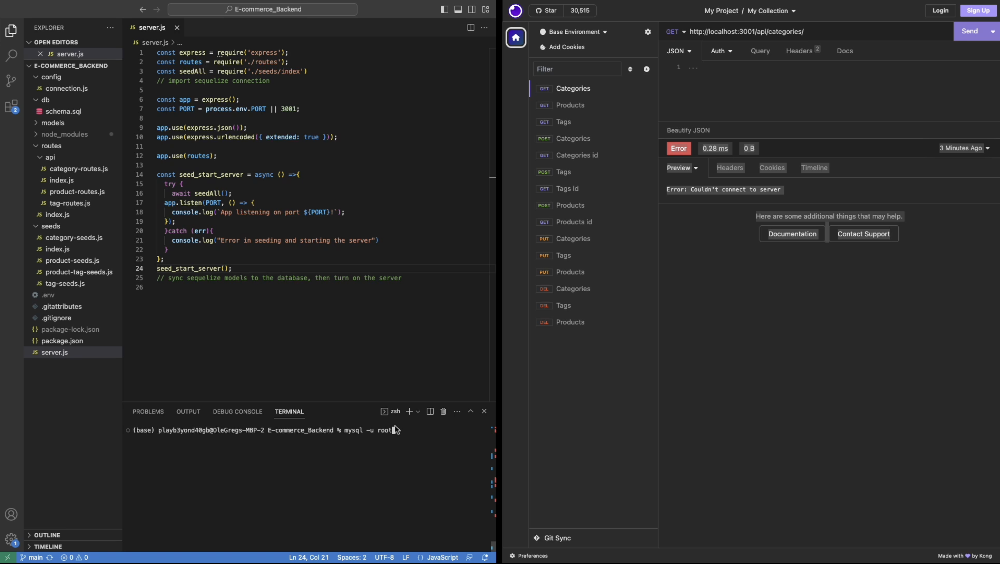

# E-Commerce Backend
  

  ## Description
  
  API for querying SQL database of products

  ## Table of Contents
  * [Installation](#installation)
  * [Usage](#usage)
  * [License](#license)
  * [Contribute](#contribute)
  * [Testing](#testing)
  * [Questions](#questions)
  
  ## Installation
  You will need to install the following to use this project

  `dotenv`, `express`, `mysql2` and `sequelize`

  ## Usage

  The use case for this project is An online business will be able to use the API to connect to their front end.

  Link to video demo of the application  ⤵️
  

  ## License

  This Project is licensed under [MIT](https://opensource.org/licenses/MIT)

  ## Contribute

  If you would like the help contribute to this project contact GitHub

  ## Testing

  To test this project do the following,

  clone repo, use CLI command `npm install` to install all packages. Login into SQL server,  use command `source db/schema.sql;`. The use the command `node server.js`. You will also need insomnia to test the API routes.

  ## Questions
  
  For any questions related to this project contact Use GitHub repo for questions. 
  You can see more of my work on my Github [OleGreg762](https://github.com/OleGreg762)
